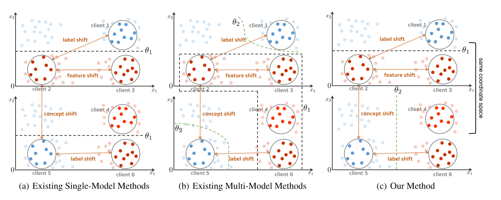

<h2 align="center"> <a href="https://arxiv.org/abs/2301.12379">FedRC: Tackling Diverse Distribution Shifts Challenge in Federated Learning by Robust Clustering</a></h2>

<h5 align="center"> If our project helps you, please give us a star ⭐ and cite our <a href="#bibliography">paper</a>!</h2>
<h5 align="center">

[](https://arxiv.org/abs/2301.12379)
[](https://hits.seeyoufarm.com)

## Overview

Despite the success of existing methods in addressing data heterogeneity in FL, most existing methods concentrate on single shift types. However, new challenges posed by the simultaneous occurrence of multiple types of distribution shifts can not be resolved:
- Methods that training single global models suffer from a significant performance drop when dealing with concept shift;
- Existing multi-model approaches cannot distinguish between different shift types and tend to group data with the same labels into the same clusters, thereby tending to overfit local distributions;

Therefore, we design FedRC to *separating clients with concept shifts into different clusters, while keeping clients without concept shifts in the same cluster*.

<div align="center">
    
    <br/>
    <figcaption>Overview of FedRC.</figcaption>
</div>

## Environments

```
Pillow == 8.1.2
tqdm
scikit-learn == 0.21.3
numpy == 1.19.0
torch == 1.2.0
matplotlib == 3.1.1
networkx == 2.5.1
cvxpy
torchvision
tensorboard
```

## Data

Please split data by the following scripts. The [make_cifar_c.py](create_c/make_cifar_c.py) uses CIFAR100 dataset by default.
```
python create_c/make_cifar_c.py

python create_c/make_fmnist_c.py

python create_c/make_tinyimagenet_c.py
```


## Scripts

```

python run_experiment.py cifar10-c fedrc --n_learners 3 --n_rounds 200 --bz 128 --lr 0.06 --lr_scheduler constant --log_freq 1 --device 0 --optimizer sgd --seed 1 --verbose 1 --suffix 06-lr

```
All the supported algorithms can be found in [constants.py](utils/constants.py). The default models are avaliable in [models.py](models.py). The detailed explanation of arguments can be found in [args.py](utils/args.py).

## Acknowledgement
We are grateful for the following awesome projects:
* [FedEM](https://github.com/omarfoq/FedEM)
* [Robustness Benchmark](https://github.com/hendrycks/robustness)
* [FedSoft](https://github.com/ycruan/FedSoft)
* [IFCA](https://github.com/jichan3751/ifca)

## Bibliography
If you find this repository helpful for your project, please consider citing:
```
@inproceedings{
    guo2024fedrc,
    title={Fed{RC}: Tackling Diverse Distribution Shifts Challenge in Federated Learning by Robust Clustering},
    author={Yongxin Guo and Xiaoying Tang and Tao Lin},
    booktitle={Forty-first International Conference on Machine Learning},
    year={2024},
    url={https://openreview.net/forum?id=kc4dZYJlJG}
}
```
